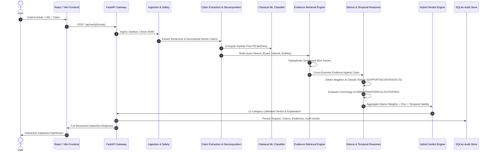

# TruthLens System Architecture

## 1. Executive Architecture Overview

**TruthLens** is an explainable, evidence-driven verification system engineered to solve the fundamental limitation of traditional fake news detectors: **reliance on closed-vocabulary stylistic classification without external factual grounding**.

The system implements a multi-stage hybrid pipeline:
1. Ingestion & Preprocessing (Text, URL, Single Claim)
2. Linguistic & Structural Normalization (Language identification: English, Hindi, Hinglish)
3. Atomic Claim Extraction & Decomposition
4. Linguistic Machine Learning Prior Estimation (TF-IDF + Calibrated Linear SVM / Naive Bayes)
5. Multi-Strategy Query Generation
6. Dual-Mode Retrieval (Google Fact Check Tools API + Web Evidence Retrieval + Curated Ground Truth Benchmark)
7. Source Evaluation, Credibility Scoring & Syndication Deduplication
8. Natural Language Inference (NLI) & Contradiction Detection
9. Temporal Consistency & Chronological Reasoning
10. Context Distortion & Statistical Cherry-Picking Analysis
11. Hybrid Verdict Engine (11 Granular Epistemic Verdicts)
12. Grounded Explanation Generation & Traceable Citations

---

## 2. Sequence Diagram

---

## 3. Component Details & Design Contracts

### 3.1 Ingestion & Security Module
- **SSRF Prevention**: Strict RFC1918 private subnet checks, IPv6 loopbacks, and cloud metadata (`169.254.169.254`) filtering before executing external GET requests.
- **Prompt-Injection Defense**: Pre-filters untrusted scraped web content using regex heuristics to defuse instructions aimed at altering fact-checking evaluations.

### 3.2 Claim Extraction & Decomposition Engine
- Parses complex syntax into atomic propositions using dependency and coordinating conjunction boundaries.
- Segregates opinions, rhetorical inquiries, and satire from empirical claims.

### 3.3 Hybrid Verdict Fusion Matrix
Instead of a naive binary output ($y \in \{0, 1\}$), the engine synthesizes evidence along three orthogonal axes:
- **Corroboration Score**: $S = \sum_{i} W_i \cdot \mathbb{I}(\text{stance}_i = \text{SUPPORTS})$
- **Contradiction Score**: $C = \sum_{j} W_j \cdot \mathbb{I}(\text{stance}_j = \text{CONTRADICTS})$
- **Temporal Freshness**: Identifies whether the claim describes a past reality that is now outdated.

Output Verdicts:
`SUPPORTED`, `LIKELY_TRUE`, `PARTIALLY_TRUE`, `MISLEADING`, `UNSUPPORTED`, `LIKELY_FALSE`, `FALSE`, `OUTDATED`, `UNVERIFIABLE`, `SATIRE`, `OPINION`.
